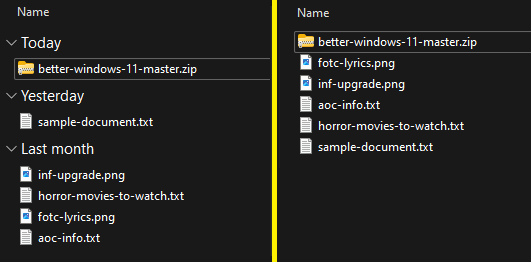

*I recently bought a laptop that runs Windows 11, it was the only option at the time or I would have stuck with 10. I had a feeling it would be bad, but it was much worse than I expected. If Windows 7 was still supported by modern apps I'd still be using that.*  

*This readme/repo is a personal collection of tools and guides I've used to optimize and un-fuck Windows 11. Includes privacy tweaks and other QOL improvements.*

<!--   
<details> 
<summary>Text</summary><br>    

Content

</details>
-->

--------------------------------------------------------------------

<details> 
<summary>Disable telemetry/tracking/spyware/cortana ect</summary><br>  
  
*This is an excellent all-in-one tool that works with both Windows 10 and Windows 11. It has a large number of features that I consider to be essential for any modern Windows system. See the website for more info.* 
  
1. Download [ShutUp10++](https://www.oo-software.com/en/shutup10)  
2. Run the file  
3. Click "Actions" -> "Apply only recommended settings"  
4. Wait 5 seconds then close the app

</details>

--------------------------------------------------------------------

<details> 
<summary>Improved image viewer</summary><br>    

*The "Photos" app bundled with Windows 11 is a massive downgrade with very limited features and poor optimization. ImageGlass is an excellent, lightweight image viewer with support for 80+ formats and includes many other great features. It's not essential, but highly recommended*

1. Download [ImageGlass](https://imageglass.org/)  
2. Run/Install

</details>

--------------------------------------------------------------------

<details> 
<summary>Unable to unpin one-drive from file view</summary><br>  

1. Click on Start, search for command prompt  
2. Right-click and select "Run as Administrator"
3. Paste the following command:  
```
del "%AppData%\Microsoft\Windows\Recent\AutomaticDestinations\f01b4d95cf55d32a.automaticDestinations-ms"
```  

</details>

--------------------------------------------------------------------

<details> 
<summary>Disable "Group By" for all folders</summary><br>  

  

1. Download [WinSetView](https://github.com/LesFerch/WinSetView)  
2. Extract, run and hit "Submit"  

</details>

--------------------------------------------------------------------

<details> 
<summary>Restore old context menu</summary><br>  

*For some reason Windows 11 downgraded the context menu, showing a "simplified" version until you click "show more". This tweak ensures the full context menu is always shown.*  

1. Click on Start, search for command prompt  
2. Right-click and select "Run as Administrator"
3. Paste the following command:  
```
reg.exe add "HKCU\Software\Classes\CLSID\{86ca1aa0-34aa-4e8b-a509-50c905bae2a2}\InprocServer32" /f
``` 
4. Open task manager (Ctrl + Shift + Esc)  
5. Open "details" view
6. Right click `explorer.exe` and select "End Task"  
7. Click "run new task" at the top of the window
8. Type `explorer.exe` and hit enter 
   
</details>

--------------------------------------------------------------------

<details> 
<summary>Disable snap layouts on hover</summary><br>   

Some people find this feature useful, some may not. I found the popups to be annoying so here's how to disable it:  

  

1. Open start menu
2. Search for `multitasking settings`  
3. Expand "Snap Windows" to show all options  
4. Uncheck "Show snap layouts when I hover over a window's maximize button"

Optional: You may also want to uncheck "Show snap layouts when I drag a window to the top of the screen"


</details>

--------------------------------------------------------------------

<details> 
<summary>Disable checkboxes in file explorer</summary><br>    

  

1. Open start menu  
2. Search "File Explorer Options"  
3. Click on the "View" tab  
4. Locate "Use check boxes to select items" and disable it  
5. Press "Apply"

</details>

--------------------------------------------------------------------


<details> 
<summary>Remove language selector from task bar</summary><br>  

Very small annoyance. This simply removes the language selector from the task bar. It's not something I use or want, so hiding it saves a small amount of space for other apps.

  

1. Open start menu
2. Search "Advanced keyboard settings"  
3. Check "Use the desktop language bar when it's available"  
4. Open "Language bar options"  
5. Select "Hidden" under "Language Bar"  
6. Apply

</details>

--------------------------------------------------------------------

<details> 
<summary>Disable web results in search</summary><br>  

This disables the "Search with Bing" garbage that pops up when I am trying to find a file or app **on my computer**. If I wanted to search the web I would open the browser, I don't know why Microsoft added such a stupid feature. There's also several privacy concerns with important file names being sent to their search engine without permission.  

  
  
1. Open start menu  
2. Search "regedit" and open the Registry Editor  
3. Navigate to `HKEY_CURRENT_USER\Software\Policies\Microsoft\Windows`  
4. If the `Explorer` folder does not exist:
    - Right click the `Windows` folder and click `New -> Key`  
    - Type `Explorer` and confirm  
5. Right click the `Explorer` folder and click `New -> DWORD (32-bit) Value`  
6. Set the value name to `DisableSearchBoxSuggestions` and value data to `1`  
7. Press OK and restart your computer

If done correctly, the registry entry should look like this: [verify](images/DisableSearchBoxSuggestions-verify.png)

</details>

--------------------------------------------------------------------


